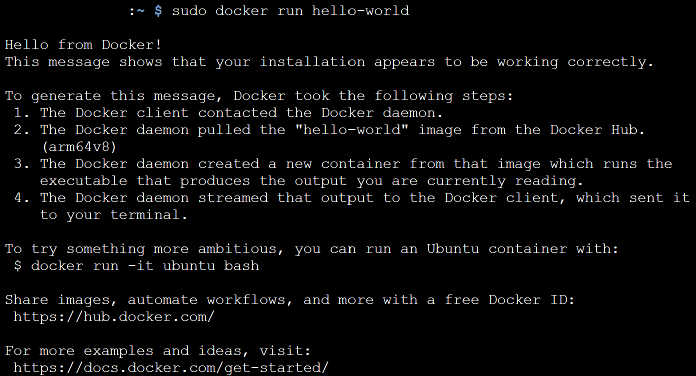
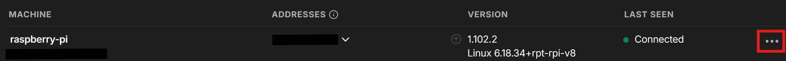
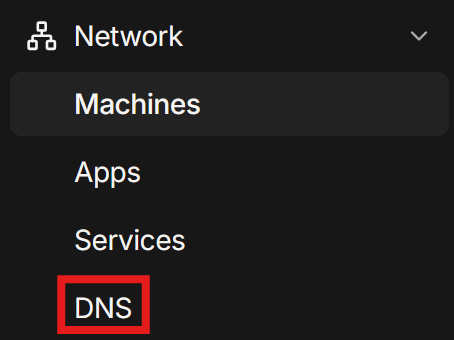
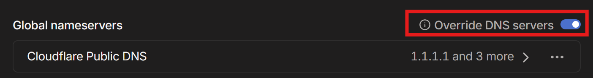
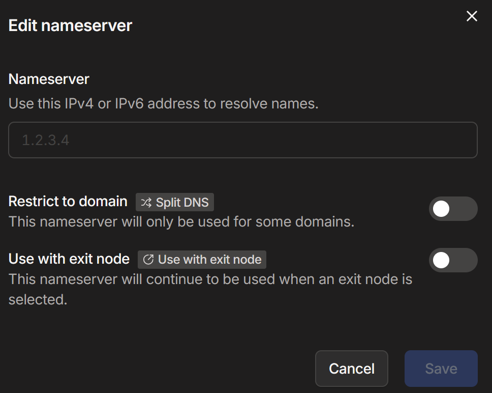
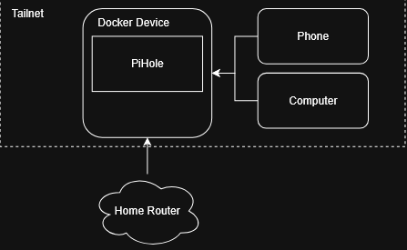

# Pihole + Tailscale Home Network Setup

## Overview
This project shows my documentation on how I set up Pihole with Tailscale for my home network, as well as for my devices when I am not connected at home. This allowed me to block malicious/tracking domains network wide, as Pihole acts as a DNS-Level filter in this example.

## Why did I choose __Pihole__?
I chose Pihole because of its DNS sinkhole. DNS sinkholes allow the blocking of ads by preventing known advertiser domains (`ads.123embed.net`) from communicating to applications by dropping the DNS query, allowing for a _mostly_ ad free experience on all devices on the network. 

It does this by rerouting advertiser-bound/attacker bound queries to a "dead" ip address, e.g `0.0.0.0`. This has additional benefits too, as you have the ability to block DNS requests to malicious actor controlled servers, increasing the security of your network. This principle also applies to malicious traffic going to known C2C servers, preventing traffic from reaching attacker controlled networks, increasing the security of your networks.

## Why did I use __Tailscale__?
Tailscale has been my go-to as a virtual network manager. It allows me to create a software defined mesh network I can control, so if I did not have control over my own network/router - I could add my devices to my Tailscale Network (or `Tailnet` for short) and control various settings from there.

In this case, I used it to connect my devices to my Pihole even when I was not at home, as the administrator of my Tailnet, I could set my DNS to the device running Pihole to keep my adblocking abilities.

Using Tailscale also had additional benefits, it is much safer than port forwarding as it does not expose your router to the internet. Tailscale only allows devices connected to your Tailnet to access each other, so you do not run the risk of an attacker trying to break into your network.

## Setup
Prerequisites:
- Already running on a supported operating system
- Internet Access

Requirements:
- At _least_ 4GB RAM
- 2GB storage minimum (4gb recommended)
- Running on a __supported operating system__ (see links below)

(You can find requirements for [Pihole](https://docs.pi-hole.net/main/prerequisites/), [Tailscale](https://tailscale.com/docs/install) and [Docker](https://docs.docker.com/desktop/setup/install/linux/#general-system-requirements))

### 1) Install Tailscale on the device
Register a Tailscale account [here](https://tailscale.com/) (if you do not have an account already)

Install Tailscale using the command `curl -fsSL https://tailscale.com/install.sh | sh` in the terminal

Once it has been installed, run `sudo tailscale up`

Authenticate your device using the link provided, logging into your Tailscale account

### 2) Install Docker on the device
NOTE: I am using Raspberry Pi OS version 6.3, so commands/installation steps may differ from here

I will be using the instructions for [Installing Docker on Debian](https://docs.docker.com/desktop/setup/install/linux/debian/)


Install GNOME Terminal using `sudo apt install gnome-terminal`

Then run the following command in the terminal:
```
# Add Docker's official GPG key:
sudo apt update
sudo apt install ca-certificates curl
sudo install -m 0755 -d /etc/apt/keyrings
sudo curl -fsSL https://download.docker.com/linux/debian/gpg -o /etc/apt/keyrings/docker.asc
sudo chmod a+r /etc/apt/keyrings/docker.asc

# Add the repository to Apt sources:
sudo tee /etc/apt/sources.list.d/docker.sources <<EOF
Types: deb
URIs: https://download.docker.com/linux/debian
Suites: $(. /etc/os-release && echo "$VERSION_CODENAME")
Components: stable
Architectures: $(dpkg --print-architecture)
Signed-By: /etc/apt/keyrings/docker.asc
EOF

sudo apt update
```

Note: You can replace `$VERSION_CODENAME` with your corresponding release if you are using **Debian** or **Debian Derivatives**

Install docker packages with the command `sudo apt install docker-ce docker-ce-cli containerd.io docker-buildx-plugin docker-compose-plugin`

- You can check if Docker is running by using the command `sudo systemctl status docker`
- If it is not running, run it by using the command `sudo systemctl start docker`

Finally, verify the installation by running the command `sudo docker run hello-world`
- This command just installs a hello-world image which is often used to test if Docker is running, and prints hello world to the terminal!



### 3) Install Pihole as a Docker Container
If you want, you can use the yaml provided [here](docker-compose.yml)
If not, find the template YAML file [here](https://docs.pi-hole.net/docker/)

Download either of the files above

**Note: you want to set `FTLCONF_dns_listeningMode` to ALL for it to work on your Tailnet**

Make a new directory to keep the docker-compose file
CD (change directory) into the directory containing the file using `cd [PATH]`
Run `docker compose up -d` to build and start Pihole (or `docker compose` for older systems)

### 4) Change DNS addresses to match your Device IP
Now that you have set up the relevant software, you will need to configure your devices to send their DNS requests to your Pihole

It is possible to both run Pihole on your local network and on your Tailnet

Run `ifconfig` to find the IP Addresses of your device.
You want to specifically look for your `wlan0` interface IP Address (inet), and your `tailscale0` interface IP Address (inet). Note both of these addresses down.

#### **Router Setup (this is not always possible)**
Log into your router's admin console. _Usually_ the IP Address is usually `192.168.0.1` and its password should be on the router, however if you are in managed accommodation or do not have control of your router, skip to the Tailnet Setup section below.

We need to set a **DHCP Reservation**, this gives our device a __static IP__ which will prevent devices from failing to connect to the internet in the future as normally devices have a __dynamic IP address__ (i.e it changes from time to time).

If you have the option to make a DHCP Reservation for your device, assign it a memorable IP Address, you will need this later. If you can, you can give it a name too to help identify it from other devices.

Once that is complete, find your router's DNS settings (if possible) and change that to your device's `wlan0` IP address and reboot your router to finalise the changes.

And your Pihole is set up for your Local Network!

#### **Tailnet Setup**
Install Tailscale on the devices of your choice (preferably ones that will frequently leave your home network, or all devices if you cannot control your router). 

Once added, they should appear on your Tailnet like so:



Press the `...` icon on the right hand side (highlighted in the red box) and click on **disable key expiry**, this stops your device from having to reauthenticate with the Tailnet every time they key expires by stopping that entirely.

Then, go back to your network settings and go to the `DNS` section (see image below)



After that, find the setting called `Global Name Servers` (see below) and enable `Override DNS Servers`



Delete the default setting, and `add nameserver`
Add the `tailscale0` IP address of the device that has Pihole into the IP address option shown below:



Save the nameserver changes and your Tailnet is now set up!

With this complete, you should have DNS-Level ad-blocking enabled on your local network and on devices connected to your Tailnet.

## Security Implications
1) `FTLCONF_dns_listeningMode` set to `ALL` is typically a security risk IF your router is port forwarding (thus exposed to the internet). This is because malicious actors can launch DNS Amplification Attacks, where the attaacker sends a DNS query to our `pihole` that produces a large response and spoofs the victim IP address (pretending to be them) and responds with that large package.

Although this is normally a risk, because of our setup being isolated (only connected to our Tailnet and router, which in my case did NOT have port forwarding on) it is not possible for this attack to occur.

2) Disabling key expiry is a measured risk, this is because key expiry is a safety check used to ensure that a device still belongs to your network. However, with this disabled there is a risk that the device is forgotten and compromised and must be manually removed.

This is a measured risk, this is usually **only** acceptable if it is a headless server as it would be hard to reauthenticate, and as our Pihole acts as a DNS resolver, it would be very bad if it did go down. 

## Architecture


## Lessons Learnt
- I learnt (after many failed attempts) that to allow Tailnet DNS Requests, you had to set `FTLCONF_dns_listeningMode` to ALL
- Make sure to install Docker correctly! It is more of a hassle uninstalling it and its dependencies if you do it wrong, so make sure you follow the correct instructions. In my case, I tried `sudo apt-get install docker.io` to try avoid the more tedious process of installing it, but I had to start over as it did not work.
- If others rely on your Pihole setup, you become the system administrator of the network! You will be the first person asked if anything goes wrong, so if you do not want that responsibility keep it on for devices on your Tailnet **only**

## Results
